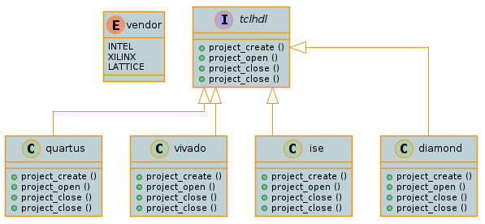
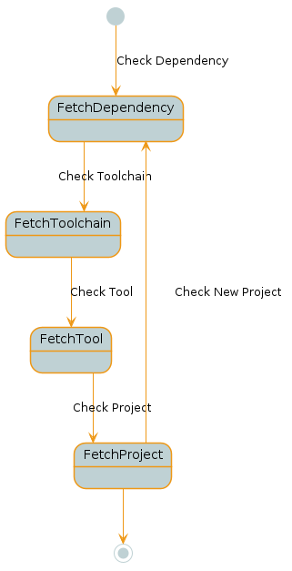

Introduction
============

(Under development - No Release Available)

TCLHDL is a set of tcl scripts intended to aid FPGA Developers setting
up projects in an easy, reliable way and independent (as far as possible)
of vendor tools.

Besides of most vendors ship with their tools a Tcl engine, their Tcl subset
is significant different both on the flow and syntax. Mantaining Fpga projects
where one need to keep hardware designs, ip cores or libraries portable between
Vendors and families, is such a task where is easy to come up with every kind of
tailored scripts and workarounds.

The idea of TclHdl is at some extend to cope with those kind of issues, helping
to mantaining FPGA projects and easily integrated on CI\CD System.

TclHdl as its name sugests is developed on Tcl and reason for that is to take 
advantage of Vendor Tool's Tcl engine for executing the different procedures.
Doing that there is no need to be dependent on other tools and makes TclHdl easy
to port among diferent Operating Systems.

The details of TclHdl internals will be present on the following sections.

Overview
--------

In order to be compatible among Vendors and at same time easy to maintain FPGA
projects such a library needs to reduce as far as possibe is subset without loosing
to much flexibility and specifity . Of course, that is dificult, and if we try
from the very begining to tackle all possible cases TclHdl was not even born.

The reasoning is provide a Tcl interface subset where it can be extendend and
specialized depending on Vendor tool. On this sense, TclHdl will provide to the
End-User an API abstracting the specific tool

On the Tcl community there are a couple of packages supporting Object Oriented programing
however not all Vendor's Tools Tcl engines are shipped with that. Then that makes
more difficult to implement a OO architecture. Either way the high level idea is there and
the next image tries to show that.

   Overview

Architecture
------------

.. figure:: ../_images/Architecture.png
   :alt: Api Architecture

   Api Architecture

Flow
----

   Development Flow

